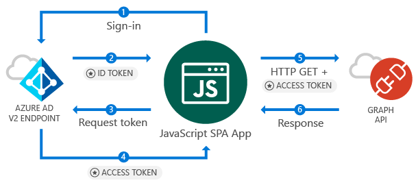

# Option 1: Sign-in users and acquire an access token from a JavaScript application

This quickstart contains a code sample that demonstrates how a JavaScript Single Page Application (SPA) can sign in personal, work and school accounts, get an access token, and call the Microsoft Graph API.



## Register your app and download a sample application

- [Register Application and Download the pre-configured Visual Studio project](https://github.com/Azure-Samples/active-directory-javascript-graphapi-v2/archive/VisualStudio.zip)
- [Register Application and Download the pre-configured project files for a local web server, such as Python](https://github.com/Azure-Samples/active-directory-javascript-graphapi-v2/archive/core.zip)
- [Open GitHub Repo](https://github.com/Azure-Samples/active-directory-javascript-graphapi-v2)

## Quickstart Basics

### *msal.js*
MSAL is the library used to sign in users and request tokens used to access an API protected by Microsoft Azure Active Directory. The Quickstart's *index.html* contains reference to the library:

```html
<script src="https://secure.aadcdn.microsoftonline-p.com/lib/0.1.1/js/msal.min.js"></script>
````

### MSAL initialization

The quickstart code also shows how you how you initialize the library:

```javascript
var userAgentApplication = new Msal.UserAgentApplication(msalconfig.clientID, null, loginCallback, {
    redirectUri: msalconfig.redirectUri
});
```
Where:
* **ClientId** is the Application Id from the application registered in the Azure Portal
* **loginCallBack** is the name of a callback method called after the authentication
* **redirectUri** is the URL where user will be sent after authentication against Azure AD v2 Endpoint

### Sign-in users

Below how you sign in users:

```javascript
userAgentApplication.loginRedirect(graphAPIScopes);
```

Where:
* **graphAPIScopes** is an optional parameter to specify the API scopes required at login time, for example *user.read*

Alternativelly you may want to use *loginPopup* method to display a popup window for sign-in the user.

### Requesting tokens

Msal has two methods to used acquire tokens `acquireTokenRedirect` (or `acquireTokenPopup`) and `acquireTokenSilent`:

#### Getting a user token silently
The ` acquireTokenSilent` method handles token acquisitions and renewal without any user interaction. After `loginRedirect` (or `loginPopup`) is executed for the first time, `acquireTokenSilent` is the method commonly used to obtain tokens used to access protected resources for subsequent calls - as calls to request or renew tokens are made silently.

```javascript
// Try to acquire the token used to query Graph API silently first:
userAgentApplication.acquireTokenSilent(graphAPIScopes)
```
Where:
* **graphAPIScopes** contains the scopes being requested.

#### Getting a user token interactively

 There are situations however that you need to force users interact with Azure Active Directory v2 endpoint – some examples include:
-	Users may need to reenter their credentials because the password has expired
-	Your application is requesting access to a resource that the user needs to consent to
-	Two factor authentication is required

Calling the *acquireTokenRedirect(scope)* result in redirecting users to the Azure Active Directory v2 endpoint (or *acquireTokenPopup(scope)* result on a popup window) where users need to interact with by either confirming their credentials, giving the consent to the required resource, or completing the two factor authentication.


```javascript
userAgentApplication.acquireTokenRedirect(graphAPIScopes);
```

## What is next

Try out the JavaScript tutorials for a complete step-by-step guide on building applications and building new features, including a full explanation of this Quickstart, and other tutorials, like call Microsoft Graph API, sign-out:

> [!div class="nextstepaction"]
> [1. Sign-In users tutorial](..\tutorials\active-directory-javascriptspa-sign-in.md)